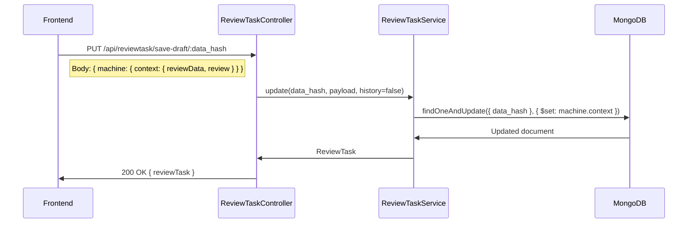

# Epic: Simplify Access to the Editor in the Fact-Checking Workflow

**PR**: [#2046](https://github.com/AletheiaFact/aletheia/pull/2046) | **Branch**: `feature/centralized-rbac-permission-system` | **Target**: `stage`

## Overview

The current fact-checking workflow in Aletheia suffers from fragmented permission logic, poor UX around draft saving and form actions, and inconsistent display of workflow status information. Fact-checkers, reviewers, and cross-checkers face friction when performing routine tasks: saving drafts requires reCAPTCHA validation, permission checks are scattered across components making them hard to maintain, and the toolbar/header lack clarity about workflow state and user assignments. This epic consolidates permissions into a centralized system, streamlines the editor experience with a dedicated draft save flow, and modernizes the review task UI to reduce friction for all participants in the fact-checking pipeline.

## Intended Outcomes

- Once this project is complete, **fact-checkers** will be able to save drafts without reCAPTCHA friction and access a clear action toolbar, which we expect to lead to faster review turnaround times and fewer abandoned drafts.
- Once this project is complete, **reviewers and cross-checkers** will be able to see clear workflow status indicators and assignee information in the sentence report header, which we expect to lead to better coordination and fewer miscommunications about task ownership.
- Once this project is complete, **anonymous users** will see a cleaner, privacy-respecting interface without internal workflow details, which we expect to lead to a more professional public-facing experience.

---

## Implementation Progress

> Tracks the current state of each user story against its acceptance criteria.

| # | User Story | Status | Notes |
|---|-----------|--------|-------|
| 01 | Centralized Permission System | Done | Merge conflict resolved, SentenceReportView migrated, legacy hook removed, type guards fixed |
| 02 | Dedicated Draft Save Endpoint | Done | Backend DTO + service + controller, frontend API, machine routing, auth via global guard |
| 03 | Action Toolbar | Done | `ActionToolbar` with sticky positioning, `PRIMARY_ACTIONS` map, `CAPTCHA_EXEMPT_EVENTS` constant |
| 04 | reCAPTCHA Popup Modal | Done | `RecaptchaModal` replaces inline captcha; `pendingCaptchaToken` ref for multi-modal chain |
| 05 | Rejection Workflow | Done | Enum, machine, events, forms, translations all wired |
| 06 | Sentence Report Header Redesign | Done | Extracted `SentenceReportHeader`, i18n chip labels, privacy guard, all state colors covered |
| 07 | Visual Editor Bug Fix | Done | Event filtering prevents toJSON error |
| 08 | Form Validation UX | Done | `AletheiaAlert` error banner, scroll-to-first-error via `field-{name}` IDs, i18n messages |
| 09 | Debug Mode (stretch) | Done (disabled) | Debug infra in atoms/hooks; UI panel removed from SentenceReportView (dead code cleanup) |
| 10 | FactCheckingInfo (stretch) | Done | Component with i18n integrated |
| 11 | Workflow Progress Bar | Done | Horizontal dot stepper for FactChecking, InformativeNews, and Request models |

### Known Blockers (must fix before anything else)

All blockers from Phase 1 have been resolved:

1. ~~**Merge conflict in `VisualEditorProvider.tsx`**~~: Resolved — kept permissions approach + `useMemo` wrapper.
2. ~~**Invalid enum reference `ReviewTaskStates.reviewing`**~~: Removed from `SentenceReportView.tsx`.
3. ~~**PR review feedback on type guards**~~: Fixed in `usePermissions.ts` with `Object.values(ReviewTaskStates).includes()` validation.

---

## Phased Implementation Plan

All work lands in a single PR. Phases represent the recommended **order of implementation** based on dependencies.

```
Phase 1: Stabilize ✅       Phase 2: Backend ✅    Phase 3: Frontend UX ✅   Phase 4: Polish ✅
(fix what exists)           (new endpoint)         (new components)          (validation + cleanup)

[01] ✅ Fix blockers ─────► [02] ✅ Draft save ──► [03] ✅ Action Toolbar ─► [08] ✅ Form Validation
[01] ✅ Complete adoption    endpoint               [04] ✅ reCAPTCHA Modal   [06] ✅ Extract header
[05] ✅ Done                 [02] ✅ reCAPTCHA opt                            [06] ✅ Privacy guard
[07] ✅ Done                                                                  [11] ✅ Progress bar
[09] ✅ Done
[10] ✅ Done
```

### Phase 1: Stabilize Existing Work ✅
**Goal**: Make the current code compile and pass review.

- [x] Resolve merge conflict in `VisualEditorProvider.tsx` (kept permissions approach + useMemo)
- [x] Fix `ReviewTaskStates.reviewing` → removed invalid enum case in `SentenceReportView.tsx`
- [x] Address PR review comment: use `ReviewTaskStates` enum as type guard in `usePermissions.ts`
- [x] Migrate remaining inline permission checks in `SentenceReportView` to use `useReviewTaskPermissions`
- [x] Remove unused `useLegacyPermissions` bridge hook
- [x] Verify all translations exist in both EN and PT for `confirmRejection`

### Phase 2: Backend — Draft Save Endpoint ✅
**Goal**: Create the dedicated draft save path on the server.

- [x] Create `SaveDraftDTO` in `server/review-task/dto/save-draft.dto.ts`
- [x] Add `PUT /api/reviewtask/save-draft/:data_hash` to `ReviewTaskController`
- [x] Implement service method: field-level `$set` operations (avoids type conflicts)
- [x] Authentication guard: global `SessionOrM2MGuard` (APP_GUARD) already protects all non-public routes
- [ ] Add unit tests for the new endpoint
- [x] Create frontend API method in `src/api/reviewTaskApi.ts`
- [x] Route `SAVE_DRAFT` event in `reviewTaskMachine.ts` to dedicated endpoint (bypasses reCAPTCHA)
- [x] Exempt draft/goback/preview buttons from captcha disable logic in `DynamicReviewTaskForm.tsx`

### Phase 3: Frontend UX — Toolbar + reCAPTCHA Modal ✅
**Goal**: Build the new action toolbar and reCAPTCHA modal that consume the draft endpoint.

- [x] Create `RecaptchaModal` component (on-demand modal replacing persistent widget)
- [x] Build sticky `ActionToolbar` within `DynamicReviewTaskForm`
- [x] Wire "Save Draft" button to the new `save-draft` API (no reCAPTCHA)
- [x] Wire "Submit/Publish" buttons through `RecaptchaModal`
- [x] Filter `SAVE_DRAFT` from state machine action buttons to avoid duplication
- [x] Implement smart primary action detection based on workflow state

### Phase 4: Polish — Validation + Header ✅
**Goal**: Complete the header redesign and add form validation UX.

- [x] Extract `SentenceReportHeader` component from `SentenceReportView`
- [x] Add privacy guard: hide header from logged-out users
- [x] Add form validation error alerts with visual feedback
- [x] Implement scroll-to-first-error on validation failure
- [x] Internationalize error messages in EN/PT
- [x] Build `WorkflowProgress` stepper component (US-11)

---

# Scope / User Stories

### Must-haves (Committed)

#### [US-01] Centralized Permission System
> **Phase**: 1 (Stabilize) | **Status**: Done ✅

As a developer, I want a single `useReviewTaskPermissions` hook that consolidates all RBAC logic, so that permission checks are consistent and maintainable across the review workflow.√

**Acceptance Criteria**:
- [x] All permission checks (isReviewer, isCrossChecker, isAssignee, isAdmin) are resolved from one hook
- [x] State machine remains the source of truth for available events; permissions act as a filtering middleware
- [x] Existing permission behavior is preserved without regressions
- [x] All review task components consume permissions from this hook (no inline role checks)
- [x] Permission resolver uses `ReviewTaskStates` enum as type guard (not raw strings)

**Files**:
- `src/machines/reviewTask/permissions.ts` — Permission resolver (523 lines, covers all 10 workflow states)
- `src/machines/reviewTask/usePermissions.ts` — React hook wiring resolver to XState + Jotai (returns `PermissionContext & UserAssignments`)
- Consumers: `DynamicReviewTaskForm`, `ClaimReviewForm`, `VisualEditorProvider`, `SentenceReportView`

**Completed work**:
- Resolved merge conflict in `VisualEditorProvider.tsx` (kept permissions + useMemo)
- Migrated `SentenceReportView` (removed 7 inline atoms, debug override block, manual role checks)
- Removed invalid `ReviewTaskStates.reviewing` enum reference
- Removed unused `useLegacyPermissions` bridge hook
- Fixed type guard with `Object.values(ReviewTaskStates).includes()` validation

---

#### [US-02] Dedicated Draft Save Endpoint
> **Phase**: 2 (Backend) | **Status**: Done ✅

As a fact-checker, I want to save my draft without reCAPTCHA validation, so that I can save work-in-progress without unnecessary friction.

**Acceptance Criteria**:
- [x] New `PUT /api/reviewtask/save-draft/:data_hash` endpoint handles draft persistence
- [x] Draft saves do not create history records (performance optimization)
- [x] Draft saves do not trigger workflow state transitions
- [x] Payload is validated through a dedicated `SaveDraftDTO`
- [x] Endpoint requires authenticated session (Ory Kratos) but no reCAPTCHA (covered by global `SessionOrM2MGuard`)
- [x] Frontend API method exists in `src/api/reviewTaskApi.ts`

**Key files created/modified**:
- `server/review-task/dto/save-draft.dto.ts` (new — strict DTO with class-validator)
- `server/review-task/review-task.controller.ts` (new route before wildcard)
- `server/review-task/review-task.service.ts` (field-level `$set` operations)
- `src/api/reviewTaskApi.ts` (new `saveDraft` method)
- `src/machines/reviewTask/reviewTaskMachine.ts` (draft event routing in `transitionHandler`)
- `src/components/ClaimReview/form/DynamicReviewTaskForm.tsx` (captcha exemption for draft/goback/preview)

---

#### [US-03] Prototype-Style Action Toolbar
> **Phase**: 3 (Frontend UX) | **Status**: Done ✅ | **Depends on**: US-02

As a fact-checker, I want a sticky toolbar at the bottom of the review form with clear actions (Save Draft, Submit), so that I always have access to key actions regardless of scroll position.

**Acceptance Criteria**:
- [x] Toolbar is sticky/fixed at the bottom of the form
- [x] Smart primary action detection based on current workflow state (`PRIMARY_ACTIONS` map)
- [x] Save Draft action calls the dedicated endpoint (no reCAPTCHA)
- [x] Submit/Publish actions require reCAPTCHA via popup modal (US-04)
- [x] `SAVE_DRAFT` is filtered from main state-machine action buttons to avoid duplication
- [x] Toolbar renders appropriately for all user roles (fact-checker, reviewer, cross-checker)

**Files**:
- `src/components/ClaimReview/form/ActionToolbar.tsx` — Sticky toolbar with `PRIMARY_ACTIONS` map, `CAPTCHA_EXEMPT_EVENTS` constant
- `src/components/ClaimReview/form/DynamicReviewTaskForm.tsx` — Consumer, passes events + permissions + handlers

---

#### [US-04] reCAPTCHA Popup Modal
> **Phase**: 3 (Frontend UX) | **Status**: Done ✅ | **Depends on**: US-03

As a fact-checker, I want the reCAPTCHA verification to appear as a popup only when I click a protected action, so that the form is less cluttered during editing.

**Acceptance Criteria**:
- [x] Persistent `AletheiaCaptcha` widget is replaced with an on-demand `RecaptchaModal`
- [x] Only protected events (submit, publish) trigger the reCAPTCHA modal
- [x] Non-protected events (save draft, navigation, comments) bypass reCAPTCHA entirely
- [x] Modal includes internationalized title, cancel button, and loading state
- [x] All existing button disable logic (`!hasCaptcha` guard) is removed in favor of modal flow

**Files**:
- `src/components/Modal/RecaptchaModal.tsx` — On-demand modal wrapping `AletheiaCaptcha`
- `src/components/ClaimReview/form/DynamicReviewTaskForm.tsx` — `pendingAction` state + `handleRecaptchaConfirm/Cancel` handlers

---

#### [US-05] Cross-Checking Comment Rejection Workflow
> **Phase**: 1 (Stabilize) | **Status**: Done

As a reviewer, I want to reject a cross-checking comment with a confirmation dialog, so that the rejection is intentional and documented.

**Acceptance Criteria**:
- [x] New `confirmRejection` event in `ReviewTaskEvents` enum
- [x] Machine workflow transitions: `rejected` → `assigned` via `confirmRejection` with `saveContext` action
- [x] Rejection form fields defined in `rejectionForm.ts` (rejectionComment textarea)
- [x] `getNextEvent.ts` and `getNextForm.ts` updated to route the new event
- [x] `confirmRejection` included in `eventsWithoutVisualEditor` to prevent toJSON bug
- [x] Translations available in EN and PT

**Files**:
- `src/machines/reviewTask/enums.ts` — Added `confirmRejection = "CONFIRM_REJECTION"`
- `src/machines/reviewTask/machineWorkflow.ts` — Transition from `rejected` to `assigned`
- `src/machines/reviewTask/getNextEvent.ts` — Event routing
- `src/machines/reviewTask/getNextForm.ts` — Form mapping
- `src/components/ClaimReview/form/fieldLists/rejectionForm.ts` — Form fields
- `public/locales/{en,pt}/reviewTask.json` — Translations

---

#### [US-06] Sentence Report Header Redesign
> **Phase**: 4 (Polish) | **Status**: Done ✅

As any user viewing a report, I want to see clear workflow status and assignee information, so that I understand who is responsible and where the review stands.

**Acceptance Criteria**:
- [x] Dedicated `SentenceReportHeader` component extracted from `SentenceReportView`
- [ ] Dot-based workflow progress indicator derived from state machine definition (not hardcoded) *(moved to US-11)*
- [x] Assignee chips resolve user names instead of displaying raw IDs (via `userApi.getById`)
- [x] Color-coded state chips via `getStateColor()` function
- [x] i18n support for chip labels (Assignee, Reviewer, Cross-Checker) in EN/PT
- [x] Header is hidden from logged-out users for privacy (`isUserLoggedIn` atom guard)

**Completed work**:
- Extracted `SentenceReportHeader` component (`src/components/SentenceReport/SentenceReportHeader.tsx`)
- Added i18n keys: `assigneeChipLabel`, `reviewerChipLabel`, `crossCheckerChipLabel` in EN/PT
- Privacy guard: header hidden from anonymous users via `isUserLoggedIn` atom check
- `SentenceReportView` cleaned up: removed extracted state, effects, and functions
- Global `SessionOrM2MGuard` already protects `/save-draft/` endpoint (no explicit `@Auth()` needed)

**Files**:
- `src/components/SentenceReport/SentenceReportHeader.tsx` (new)
- `src/components/SentenceReport/SentenceReportView.tsx` (modified)
- `public/locales/en/claimReviewForm.json` (modified)
- `public/locales/pt/claimReviewForm.json` (modified)

---

#### [US-07] Visual Editor Bug Fix
> **Phase**: 1 (Stabilize) | **Status**: Done

As a cross-checker submitting a comment, I want the form to submit without errors, so that my review is not blocked by technical failures.

**Acceptance Criteria**:
- [x] Visual editor fields are filtered from comment-only events via `eventsWithoutVisualEditor` array
- [x] `TypeError: event.reviewData.visualEditor.toJSON is not a function` no longer occurs
- [x] Cross-checking, comment, selection, and navigation events all skip visual editor payload

**Files**:
- `src/components/ClaimReview/form/DynamicReviewTaskForm.tsx` — `eventsWithoutVisualEditor` array (lines ~98-117) + `filteredFormData` logic

---

#### [US-08] Form Validation UX
> **Phase**: 4 (Polish) | **Status**: Done ✅

As a fact-checker, I want clear error feedback when I submit an incomplete form, so that I can quickly identify and fix issues.

**Acceptance Criteria**:
- [x] Visual error alert (`AletheiaAlert` with `type="error"`) displayed on validation failure
- [x] Automatic scroll to the first error field using `scrollIntoView` via `field-{name}` IDs
- [x] Support for single and multiple field error messages (per-field via `DynamicForm`, summary via alert)
- [x] Error messages internationalized in EN/PT (`validationErrorTitle`, `validationErrorDescription`)
- [x] Integration with existing `react-hook-form` errors passed to `DynamicForm`

**Files**:
- `src/components/ClaimReview/form/DynamicReviewTaskForm.tsx` — `onValidationError` callback, `errorAlertRef`, `AletheiaAlert` banner
- `src/components/Form/DynamicForm.tsx` — Per-field `id="field-${fieldName}"` for scroll targeting, error styling
- `public/locales/{en,pt}/claimReviewForm.json` — `validationErrorTitle`, `validationErrorDescription`

---

#### [US-11] Workflow Progress Bar
> **Phase**: 4 (Polish) | **Status**: Done ✅ | **Depends on**: US-06

As a user viewing a review, I want a visual progress indicator showing where the review stands in the workflow, so that I can understand how far along the fact-checking process is.

**Acceptance Criteria**:
- [x] Horizontal stepper with dots connected by lines, placed in the sentence report header area
- [x] Each step has 3 visual states: completed (filled), active (highlighted), pending (gray)
- [x] Stages derived from `reportModel` + `currentState` (not hardcoded)
- [x] Handles regression: rejection sends back to Draft, steps 3-4 revert to pending
- [x] Mobile-responsive: labels hide on small screens, dots remain
- [x] i18n support for step labels in EN/PT

**State-to-stage mapping** (Fact-Checking model):

| Stage | Label | Machine States |
|-------|-------|---------------|
| 1 | Assign | `unassigned` |
| 2 | Draft | `assigned`, `reported`, `selectReviewer`, `selectCrossChecker` |
| 3 | Review | `crossChecking`, `addCommentCrossChecking` |
| 4 | Approval | `submitted`, `rejected` |
| 5 | Published | `published` |

**Simpler workflows**:
- **Informative News**: Draft → Review → Published (3 steps)
- **Request**: Assign → Assigned → Published (3 steps)

**Files**:
- `src/components/SentenceReport/WorkflowProgress.tsx` — Custom dot+line stepper using MUI `Box`
- `src/components/SentenceReport/SentenceReportHeader.tsx` — Consumer (renders inside header area)
- `public/locales/{en,pt}/reviewTask.json` — Stage label keys (`stageAssign`, `stageDraft`, etc.)

---

### Nice-to-haves (Stretch)

#### [US-09] Debug Mode for Permissions
> **Status**: Done (disabled in production)

As a developer, I want a debug mode that simulates different user roles and permission scenarios, so that I can test the permission system without switching accounts.

**Acceptance Criteria**:
- [x] `DEBUG_MODE = false` constant in `currentUser.ts` prevents activation in production
- [x] `DebugAssignmentType` enum: None, Assignee, CrossChecker, Reviewer
- [x] Debug-aware derived atoms for `isUserLoggedIn`, `currentUserRole`, `currentUserId`
- [x] `useReviewTaskPermissions` hook applies debug overrides when enabled
- [x] Debug panel UI removed from `SentenceReportView` (was dead code since `DEBUG_MODE = false`)

**Files**:
- `src/atoms/currentUser.ts` — Debug atoms and `DebugAssignmentType` enum
- `src/machines/reviewTask/usePermissions.ts` — Debug override logic

---

#### [US-10] FactCheckingInfo Component
> **Status**: Done

As a user viewing a report, I want to see structured fact-checking metadata, so that I can understand the review context at a glance.

**Acceptance Criteria**:
- [x] `FactCheckingInfo` component with Paper card, InfoIcon, heading and description
- [x] i18n support with `claimReview:factCheckingInProgress` and `claimReview:factCheckingInfoMessage`
- [x] Rendered in `ClaimReviewForm.tsx` when `canShowEditor === false`

**Files**:
- `src/components/SentenceReport/FactCheckingInfo.tsx`
- `src/components/ClaimReview/ClaimReviewForm.tsx` (consumer)

---

### Future Considerations (Out of Scope)

- **Backend RBAC Guards on All State Transitions**: Currently only the publish action has backend enforcement. Future work should add NestJS guards/decorators to enforce permissions on all review task state transitions server-side.
- **Granular Audit Trail for Draft Saves**: Draft saves currently skip history creation for performance. A lightweight audit trail could be added later.
- **Role-Based Notification System**: Notify assignees when workflow state changes or when they are assigned/reassigned.
- **Keyboard Shortcuts for Toolbar Actions**: Power users could benefit from keyboard shortcuts for save draft (Ctrl+S), submit, preview, etc.
- **Mobile-Optimized Toolbar**: The current toolbar design may need a dedicated mobile experience.

---

# Technical Design

## Proposed Solution

The solution follows a layered architecture that preserves the existing XState state machine as the single source of truth while introducing a permission middleware layer and a dedicated draft save path.

### Architecture Overview

```
┌─────────────────────────────────────────────────────────┐
│                    Frontend (Next.js)                    │
│                                                         │
│  ┌─────────────────┐  ┌──────────────────────────────┐  │
│  │ SentenceReport  │  │   DynamicReviewTaskForm      │  │
│  │ Header          │  │                              │  │
│  │ - Workflow dots │  │  ┌─────────────────────────┐ │  │
│  │ - Assignee chips│  │  │ Action Toolbar (sticky) │ │  │
│  │ - Privacy guard │  │  │ Back|Preview|Save|Submit │ │  │
│  └─────────────────┘  │  └─────────────────────────┘ │  │
│                        │  ┌─────────────────────────┐ │  │
│                        │  │  reCAPTCHA Popup Modal   │ │  │
│                        │  └─────────────────────────┘ │  │
│                        └──────────────────────────────┘  │
│                                    │                     │
│  ┌─────────────────────────────────┼──────────────────┐  │
│  │          Permission Layer       │                  │  │
│  │    useReviewTaskPermissions()   │                  │  │
│  │    - isReviewer                 │                  │  │
│  │    - isCrossChecker             │                  │  │
│  │    - isAssignee                 │                  │  │
│  │    - isAdmin                    │                  │  │
│  │    - canPerform(event)          │                  │  │
│  └─────────────────────────────────┼──────────────────┘  │
│                                    │                     │
│  ┌─────────────────────────────────┼──────────────────┐  │
│  │      XState Machine (Source of Truth)              │  │
│  │      - Defines possible states & transitions       │  │
│  │      - Events determine what CAN happen            │  │
│  │      - Permissions determine what IS ALLOWED       │  │
│  └────────────────────────────────────────────────────┘  │
└─────────────────────────────────────────────────────────┘
                             │
              ┌──────────────┼──────────────┐
              │              │              │
              ▼              ▼              ▼
     ┌──────────────┐ ┌─────────────┐ ┌────────────────┐
     │     POST     │ │     PUT     │ │      PUT       │
     │ /reviewtask  │ │ /reviewtask/│ │ /reviewtask/   │
     │              │ │ {data_hash} │ │ save-draft/    │
     │    State     │ │  Auto-save  │ │ {data_hash}    │
     │ transitions  │ │ (existing)  │ │ (NEW dedicated)│
     │ + reCAPTCHA  │ │             │ │ No reCAPTCHA   │
     └──────────────┘ └─────────────┘ └────────────────┘
```

### Backend Design

#### API Paradigm

- **Request-Response (REST)**: Consistent with the existing Aletheia API architecture. All review task operations use RESTful endpoints through NestJS controllers.

#### New Endpoint: Dedicated Draft Save



**Why a dedicated endpoint?**

- The existing `POST /api/reviewtask` requires reCAPTCHA validation and creates history/state event records
- The existing `PUT /api/reviewtask/:data_hash` (auto-save) is designed for automatic background saves, not user-initiated actions
- A dedicated draft endpoint provides: no reCAPTCHA, no history, no state transitions, strict payload validation via `SaveDraftDTO`

#### Authentication and RBAC

- **Authentication**: Session-based via Ory Kratos (unchanged)
- **Frontend RBAC**: New `useReviewTaskPermissions` hook centralizes all role checks:
  - Derives user roles from machine context (reviewerId, crossCheckerId, usersId)
  - Filters available events from state machine based on user permissions
  - Does NOT override state machine event determination (separation of concerns)
- **Backend RBAC**: Existing publish-only enforcement (noted as future consideration for expansion)

#### Interface Definitions

**SaveDraftDTO (New)**:

```tsx
{
  machine: {
    context: {
      reviewData: Partial<ReviewTaskMachineContextReviewData>
      review: {
        usersId?: string[]
        personality?: string
        isPartialReview: true  // Always true for drafts
        targetId?: string
      }
    }
  }
}
```

**Permission Hook Interface (Implemented)**:

```tsx
interface ReviewTaskPermissions {
  // Role checks
  isReviewer: boolean
  isCrossChecker: boolean
  isAssignee: boolean
  isAdmin: boolean

  // Capability checks
  canPerform: (event: ReviewTaskEvents) => boolean
  allowedEvents: ReviewTaskEvents[]

  // UI control (from PermissionContext)
  canAccessState: boolean
  canViewEditor: boolean
  canEditEditor: boolean
  editorReadonly: boolean
  canSaveDraft: boolean
  canSubmitActions: boolean
  canSelectUsers: boolean
  showForm: boolean
  showSaveDraftButton: boolean
  formType: string

  // Debug (dev only)
  debugMode?: {
    enabled: boolean
    simulatedRole: UserRole
  }
}
```

### Frontend Design

#### Component Architecture Changes

1. **`useReviewTaskPermissions` hook** (`src/machines/reviewTask/usePermissions.ts`)
   - Consumes current user from Jotai atom and machine context
   - Returns permission object used by all review task components
   - Replaces inline `checkIfUserCanSeeButtons()` logic in DynamicReviewTaskForm

2. **`SentenceReportHeader` component** (`src/components/SentenceReport/SentenceReportHeader.tsx`)
   - Extracted from SentenceReportView for better separation of concerns
   - Derives workflow steps from state machine definition (not hardcoded)
   - Maps complex state machine states to simplified linear workflow view

3. **`RecaptchaModal` component** (`src/components/ClaimReview/form/RecaptchaModal.tsx`)
   - On-demand modal wrapping reCAPTCHA verification
   - Triggered by protected action buttons (submit, publish)
   - Returns verification token via callback to complete the action

4. **Action Toolbar** (within `DynamicReviewTaskForm`)
   - Sticky positioned at form top
   - Separates draft save (direct API call) from state transitions (via machine)
   - reCAPTCHA modal triggered only for protected events

#### State Machine Changes

- New event: `confirmRejection` in `ReviewTaskEvents` enum
- New form: `rejectionForm` field list for rejection confirmation
- Updated `getNextEvent.ts` and `getNextForm.ts` to route the new event
- Updated `actions.ts` with handler for the confirmation rejection action

---

## Data Schema Changes

**No database schema changes required.** The new draft save endpoint operates on the existing `ReviewTask` collection using the same `machine.context` structure. The `SaveDraftDTO` is a strict subset of the existing `CreateReviewTaskDTO`.

Existing schema reference:

- **Collection**: `reviewtasks`
- **Key field**: `data_hash` (unique identifier, used for draft lookups)
- **Updated field**: `machine.context` (stores form data and review metadata)

---

## Alternatives Considered

| Alternative | Pros | Cons | Decision |
|---|---|---|---|
| **Modify existing auto-save endpoint for manual drafts** | No new endpoint, less code | Mixes auto-save and manual save concerns; harder to add draft-specific validation | Rejected: separation of concerns is cleaner |
| **Frontend-only RBAC (no permission hook)** | Less refactoring | Permission logic remains scattered; harder to maintain and test | Rejected: centralization is worth the refactoring cost |
| **Backend guards on all state transitions** | Stronger security model | Significant backend refactoring; risk of breaking existing flows | Deferred: marked as future consideration |
| **Remove reCAPTCHA entirely for logged-in users** | Simplest UX | Reduces bot protection on critical actions (publish, submit) | Rejected: reCAPTCHA still needed for public-facing actions |
| **Hardcoded workflow steps in header** | Simpler implementation | Breaks when state machine definition changes; maintenance burden | Rejected: deriving from machine definition is more robust |

---

## Testing Strategy

| Phase | Test Type | Scope |
|-------|-----------|-------|
| 1 | Manual | Verify compilation, existing flows don't regress |
| 2 | Unit + Integration | Draft save endpoint: DTO validation, auth guard, no history creation |
| 3 | Manual + E2E | Toolbar interactions, reCAPTCHA modal flow, draft save from UI |
| 4 | Manual | Header visual check, form validation scroll behavior, i18n |

### Key Test Scenarios

- **Permission consistency**: Assigned fact-checker sees correct actions in `reported` state
- **Draft save isolation**: Saving a draft does NOT create history records or trigger transitions
- **reCAPTCHA bypass**: Draft save works without reCAPTCHA; submit/publish still require it
- **Cross-checking comments**: Submit without `toJSON` error (regression test for US-07)
- **Privacy**: Logged-out users do not see workflow header or internal status chips
- **Debug mode**: `DEBUG_MODE = false` in production; no debug panel renders for end users
