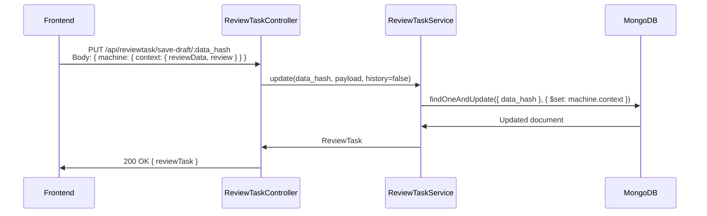

# Epic: Simplify Access to the Editor in the Fact-Checking Workflow

## Overview

The current fact-checking workflow in Aletheia suffers from fragmented permission logic, poor UX around draft saving and form actions, and inconsistent display of workflow status information. Fact-checkers, reviewers, and cross-checkers face friction when performing routine tasks: saving drafts requires reCAPTCHA validation, permission checks are scattered across components making them hard to maintain, and the toolbar/header lack clarity about workflow state and user assignments. This epic consolidates permissions into a centralized system, streamlines the editor experience with a dedicated draft save flow, and modernizes the review task UI to reduce friction for all participants in the fact-checking pipeline.

## Intended Outcomes

- Once this project is complete, **fact-checkers** will be able to save drafts without reCAPTCHA friction and access a clear action toolbar, which we expect to lead to faster review turnaround times and fewer abandoned drafts.
- Once this project is complete, **reviewers and cross-checkers** will be able to see clear workflow status indicators and assignee information in the sentence report header, which we expect to lead to better coordination and fewer miscommunications about task ownership.
- Once this project is complete, **anonymous users** will see a cleaner, privacy-respecting interface without internal workflow details, which we expect to lead to a more professional public-facing experience.

---

# Scope / User Stories

### Must-haves (Committed)

- **[01] Centralized Permission System**: As a developer, I want a single `useReviewTaskPermissions` hook that consolidates all RBAC logic, so that permission checks are consistent and maintainable across the review workflow.
- Acceptance Criteria:
- All permission checks (isReviewer, isCrossChecker, isAssignee, isAdmin) are resolved from one hook
- State machine remains the source of truth for available events; permissions act as a filtering middleware
- Existing permission behavior is preserved without regressions
- **[02] Dedicated Draft Save Endpoint**: As a fact-checker, I want to save my draft without reCAPTCHA validation, so that I can save work-in-progress without unnecessary friction.
- Acceptance Criteria:
- New `PUT /api/reviewtask/save-draft/:data_hash` endpoint handles draft persistence
- Draft saves do not create history records (performance optimization)
- Draft saves do not trigger workflow state transitions
- Payload is validated through a dedicated `SaveDraftDTO`
- **[03] Prototype-Style Action Toolbar**: As a fact-checker, I want a sticky toolbar at the top of the review form with clear actions (Back, Preview, Share, Save Draft, Submit), so that I always have access to key actions regardless of scroll position.
- Acceptance Criteria:
- Toolbar is sticky/fixed at the top of the form
- Smart primary action detection based on current workflow state
- Save Draft action does not require reCAPTCHA
- Submit/Publish actions require reCAPTCHA via popup modal
- SAVE_DRAFT is filtered from main action buttons to avoid duplication
- **[US-04] reCAPTCHA Popup Modal**: As a fact-checker, I want the reCAPTCHA verification to appear as a popup only when I click a protected action, so that the form is less cluttered during editing.
- Acceptance Criteria:
- Persistent reCAPTCHA widget is replaced with an on-demand modal
- Only protected events (submit, publish) trigger the reCAPTCHA modal
- Non-protected events (save draft, navigation) bypass reCAPTCHA entirely
- Modal includes internationalized title and cancel button
- **[US-05] Cross-Checking Comment Rejection Workflow**: As a reviewer, I want to reject a cross-checking comment with a confirmation dialog, so that the rejection is intentional and documented.
- Acceptance Criteria:
- New `confirmRejection` event in the review task state machine
- Rejection form fields are defined in `rejectionForm.ts`
- Translations available in EN and PT
- **[US-06] Sentence Report Header Redesign**: As any user viewing a report, I want to see clear workflow status and assignee information, so that I understand who is responsible and where the review stands.
- Acceptance Criteria:
- Dedicated `SentenceReportHeader` component extracted from `SentenceReportView`
- Dot-based workflow progress indicator derived from state machine definition
- Assignee chips resolve user names instead of displaying raw IDs
- i18n support for chip labels (Assignee, Reviewer, Cross-Checker) in EN/PT
- Header is hidden from logged-out users for privacy
- **[US-07] Visual Editor Bug Fix**: As a cross-checker submitting a comment, I want the form to submit without errors, so that my review is not blocked by technical failures.
- Acceptance Criteria:
- Visual editor fields are filtered from comment-only events
- `TypeError: event.reviewData.visualEditor.toJSON is not a function` no longer occurs
- Cross-checking events work reliably
- **[US-08] Form Validation UX**: As a fact-checker, I want clear error feedback when I submit an incomplete form, so that I can quickly identify and fix issues.
- Acceptance Criteria:
- Visual error alerts displayed on validation failure
- Automatic scroll to the first error field
- Support for single and multiple field error messages
- Error messages internationalized in EN/PT

### Nice-to-haves (Stretch)

- **[US-09] Debug Mode for Permissions**: As a developer, I want a debug mode that simulates different user roles and permission scenarios, so that I can test the permission system without switching accounts.
- Debug mode must be disabled in production builds
- **[US-10] FactCheckingInfo Component**: As a user viewing a report, I want to see structured fact-checking metadata, so that I can understand the review context at a glance.

### Future Considerations (Out of Scope)

- **Backend RBAC Guards on All State Transitions**: Currently only the publish action has backend enforcement. Future work should add NestJS guards/decorators to enforce permissions on all review task state transitions server-side.
- **Granular Audit Trail for Draft Saves**: Draft saves currently skip history creation for performance. A lightweight audit trail could be added later.
- **Role-Based Notification System**: Notify assignees when workflow state changes or when they are assigned/reassigned.
- **Keyboard Shortcuts for Toolbar Actions**: Power users could benefit from keyboard shortcuts for save draft (Ctrl+S), submit, preview, etc.
- **Mobile-Optimized Toolbar**: The current toolbar hides some actions on mobile. A dedicated mobile experience could be designed.

---

# Technical Design

## Proposed Solution

The solution follows a layered architecture that preserves the existing XState state machine as the single source of truth while introducing a permission middleware layer and a dedicated draft save path.

### Architecture Overview

```

┌─────────────────────────────────────────────────────────┐

│ Frontend (Next.js) │

│ │

│ ┌─────────────────┐ ┌──────────────────────────────┐ │

│ │ SentenceReport │ │ DynamicReviewTaskForm │ │

│ │ Header │ │ │ │

│ │ - Workflow dots │ │ ┌─────────────────────────┐ │ │

│ │ - Assignee chips │ │ │ Action Toolbar (sticky) │ │ │

│ │ - Privacy guard │ │ │ Back|Preview|Save|Submit │ │ │

│ └─────────────────┘ │ └─────────────────────────┘ │ │

│ │ ┌─────────────────────────┐ │ │

│ │ │ reCAPTCHA Popup Modal │ │ │

│ │ └─────────────────────────┘ │ │

│ └──────────────────────────────┘ │

│ │ │

│ ┌────────────────────────────────┼───────────────────┐ │

│ │ Permission Layer │ │ │

│ │ useReviewTaskPermissions() │ │ │

│ │ - isReviewer │ │ │

│ │ - isCrossChecker │ │ │

│ │ - isAssignee │ │ │

│ │ - isAdmin │ │ │

│ │ - canPerform(event) │ │ │

│ └────────────────────────────────┼───────────────────┘ │

│ │ │

│ ┌────────────────────────────────┼───────────────────┐ │

│ │ XState Machine (Source of Truth) │ │

│ │ - Defines possible states & transitions │ │

│ │ - Events determine what CAN happen │ │

│ │ - Permissions determine what IS ALLOWED │ │

│ └─────────────────────────────────────────────────────┘ │

└─────────────────────────────────────────────────────────┘

│

┌───────────────┼───────────────┐

│ │ │

▼ ▼ ▼

┌──────────────┐ ┌─────────────┐ ┌────────────────┐

│ POST │ │ PUT │ │ PUT │

│ /reviewtask │ │ /reviewtask/ │ │ /reviewtask/ │

│ │ │ {data_hash} │ │ save-draft/ │

│ State │ │ Auto-save │ │ {data_hash} │

│ transitions │ │ (existing) │ │ (NEW dedicated) │

│ + reCAPTCHA │ │ │ │ No reCAPTCHA │

└──────────────┘ └─────────────┘ └────────────────┘
```

### Backend Design

### API Paradigm

- **Request-Response (REST)**: Consistent with the existing Aletheia API architecture. All review task operations use RESTful endpoints through NestJS controllers.

### New Endpoint: Dedicated Draft Save



**Why a dedicated endpoint?**

- The existing `POST /api/reviewtask` requires reCAPTCHA validation and creates history/state event records
- The existing `PUT /api/reviewtask/:data_hash` (auto-save) is designed for automatic background saves, not user-initiated actions
- A dedicated draft endpoint provides: no reCAPTCHA, no history, no state transitions, strict payload validation via `SaveDraftDTO`

### Authentication and RBAC

- **Authentication**: Session-based via Ory Kratos (unchanged)
- **Frontend RBAC**: New `useReviewTaskPermissions` hook centralizes all role checks:
- Derives user roles from machine context (reviewerId, crossCheckerId, usersId)
- Filters available events from state machine based on user permissions
- Does NOT override state machine event determination (separation of concerns)
- **Backend RBAC**: Existing publish-only enforcement (noted as future consideration for expansion)

### Interface Definitions

**SaveDraftDTO (New)**:

```tsx

{

machine: {

context: {

reviewData: Partial<ReviewTaskMachineContextReviewData>

review: {

usersId?: string[]

personality?: string

isPartialReview: true // Always true for drafts

targetId?: string

}

}

}

}
```

**Permission Hook Interface (New)**:

```tsx

interface ReviewTaskPermissions {

isReviewer: boolean

isCrossChecker: boolean

isAssignee: boolean

isAdmin: boolean

canPerform: (event: ReviewTaskEvents) => boolean

allowedEvents: ReviewTaskEvents[]

debugMode?: {

enabled: boolean

simulatedRole: UserRole

}

}
```

### Frontend Design

### Component Architecture Changes

1. **`useReviewTaskPermissions` hook** (`src/machines/reviewTask/usePermissions.ts`)

- Consumes current user from Jotai atom and machine context
- Returns permission object used by all review task components
- Replaces inline `checkIfUserCanSeeButtons()` logic in DynamicReviewTaskForm

1. **`SentenceReportHeader` component** (`src/components/SentenceReport/SentenceReportHeader.tsx`)

- Extracted from SentenceReportView for better separation of concerns
- Derives workflow steps from state machine definition (not hardcoded)
- Maps complex state machine states to simplified linear workflow view

1. **Action Toolbar** (within `DynamicReviewTaskForm`)

- Sticky positioned at form top
- Separates draft save (direct API call) from state transitions (via machine)
- reCAPTCHA modal triggered only for protected events

### State Machine Changes

- New event: `confirmRejection` in `ReviewTaskEvents` enum
- New form: `rejectionForm` field list for rejection confirmation
- Updated `getNextEvent.ts` and `getNextForm.ts` to route the new event
- Updated `actions.ts` with handler for the confirmation rejection action

---

## Data Schema Changes

**No database schema changes required.** The new draft save endpoint operates on the existing `ReviewTask` collection using the same `machine.context` structure. The `SaveDraftDTO` is a strict subset of the existing `CreateReviewTaskDTO`.

Existing schema reference:

- **Collection**: `reviewtasks`
- **Key field**: `data_hash` (unique identifier, used for draft lookups)
- **Updated field**: `machine.context` (stores form data and review metadata)

---

## Alternatives Considered

| Alternative | Pros | Cons | Decision |

|---|---|---|---|

| **Modify existing auto-save endpoint for manual drafts** | No new endpoint, less code | Mixes auto-save and manual save concerns; harder to add draft-specific validation | Rejected: separation of concerns is cleaner |

| **Frontend-only RBAC (no permission hook)** | Less refactoring | Permission logic remains scattered; harder to maintain and test | Rejected: centralization is worth the refactoring cost |

| **Backend guards on all state transitions** | Stronger security model | Significant backend refactoring; risk of breaking existing flows | Deferred: marked as future consideration |

| **Remove reCAPTCHA entirely for logged-in users** | Simplest UX | Reduces bot protection on critical actions (publish, submit) | Rejected: reCAPTCHA still needed for public-facing actions |

| **Hardcoded workflow steps in header** | Simpler implementation | Breaks when state machine definition changes; maintenance burden | Rejected: deriving from machine definition is more robust |